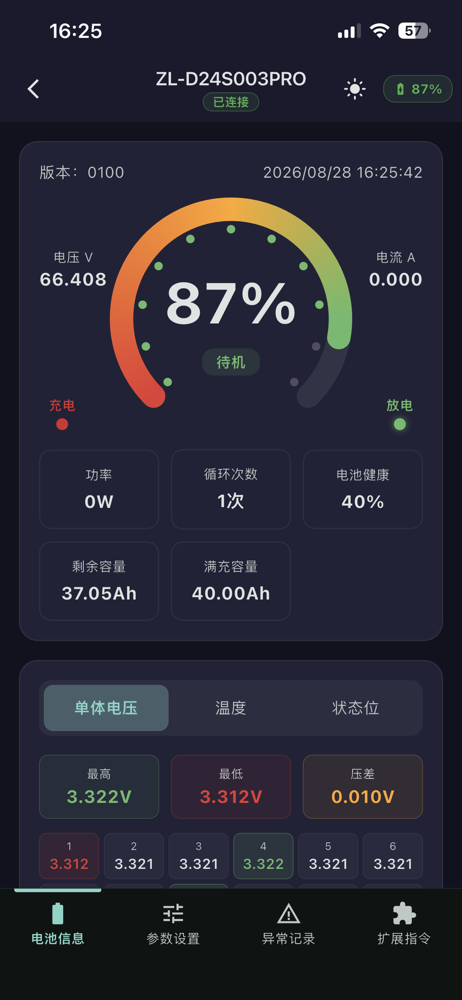
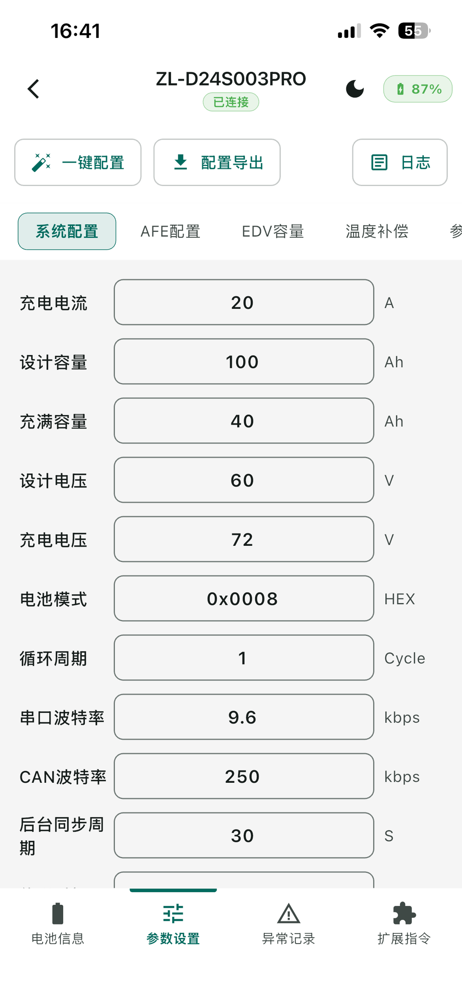
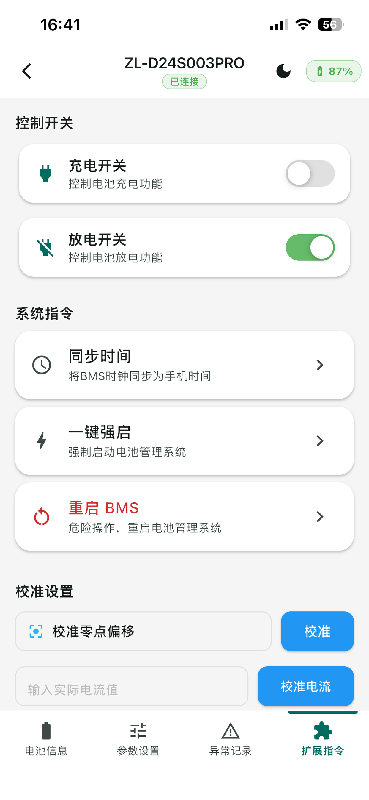

# 🔋 小龙电动 BMS —— 蓝牙电池管理系统

一套基于 **Flutter** 的 BMS（Battery Management System）蓝牙管理工具，通过 **BLE** 连接电池管理设备，实时监控电池状态，并支持参数设置、异常记录、扫码识别与配置文件管理。

> 一套代码，双品牌定制：**小龙电动** / **畅烁锂电**（Android `productFlavors` + iOS 原生标签区分）。

  

---

## ✨ 功能特性

- **蓝牙扫描与连接**：`flutter_blue_plus` 扫描、连接 BMS 设备
- **实时数据监控**：周期性轮询展示电压、电流、温度、SOC、单体电芯电压、告警标志等
- **四大功能模块**（设备页 Tab）：
  - 电池信息
  - 参数设置
  - 扩展指令
  - 异常记录
- **扫码识别**：相机扫描电池二维码，读取电池标识信息
- **配置文件管理**：配置文件的导入 / 导出 / 分享（文件选择器 + 系统分享）
- **功能解锁**：高级功能受密码保护，密码以 SHA-256 哈希存储，不可逆
- **多语言**：简体中文 / English，随系统或手动切换
- **主题**：浅色 / 深色
- **Mock 演示模式**：无实体硬件也能完整演示全部功能
- **隐私友好**：无账号、无联网、无统计 SDK，所有数据仅存本地

---

## 🧱 技术栈

| 分类 | 技术 |
|---|---|
| 框架 | Flutter 3.x / Dart 3.x |
| 状态管理 | `flutter_riverpod` |
| 蓝牙 | `flutter_blue_plus` |
| 扫码 | `mobile_scanner` |
| 本地存储 | `shared_preferences` |
| 文件 | `file_picker`、`share_plus`、`path_provider` |
| 安全 | `crypto`（SHA-256） |
| 权限 | `permission_handler` |

---

## 🏗️ 架构

基于 **Riverpod + 分层服务** 的清晰结构，UI 与业务逻辑解耦：

```
lib/
├── main.dart / app.dart          # 入口与根组件
├── models/                       # 数据模型（BMS 数据、设备、参数组、异常记录等）
├── pages/
│   ├── bluetooth/                # 蓝牙扫描与连接
│   ├── device/                   # 设备详情（电池信息/参数设置/扩展指令/异常记录）
│   ├── extensions/               # 扩展功能、配置文件管理
│   └── scan/                     # 二维码扫描
├── providers/                    # Riverpod 状态（设备数据、主题、Mock 开关）
├── services/                     # 业务层
│   ├── bluetooth_service.dart    # BLE 封装
│   ├── protocol_parser.dart      # BMS 私有协议解析
│   ├── realtime_poller.dart      # 实时数据轮询
│   ├── config_export_service.dart# 配置导入导出
│   └── feature_guard.dart        # 功能解锁（SHA-256 哈希）
├── i18n/                         # 多语言
├── theme/                        # 主题
├── utils/                        # CRC16、序列号解析等
└── widgets/                      # 通用组件
```

**核心流程**：蓝牙扫描 → 连接设备 → 协议层解析数据帧（CRC16 校验）→ `realtime_poller` 实时轮询 → Riverpod 状态驱动 UI 刷新。

---

## 🚀 CI/CD

iOS 流水线基于 GitHub Actions，**推送 `v*` tag 自动触发**：

```
push tag v* → macos-26 (Xcode 26) → flutter build ipa
            → 签名（Distribution 证书）→ altool 上传 TestFlight
```

- 运行器：`macos-26`（满足 iOS 26 SDK 上传要求）
- 签名：手动签名（Distribution 证书 + App Store Profile），密钥存于 GitHub Secrets
- 配置见 `.github/workflows/ios.yml`

---

## 📱 截图

<p align="center">
  
  
  
</p>

---

## 🛠️ 运行

```bash
flutter pub get
flutter run
```

Android 双品牌 flavor：

```bash
flutter run --flavor xiaolong
flutter run --flavor changshuo
```

> 无实体 BMS 设备时，可在设置中开启 **Mock 模式** 体验完整功能。

---

## 📄 说明

- 本项目为商业产品代码，仅供技术展示与学习参考。
- BMS 通信协议为设备厂商私有协议，解析器仅适配本项目目标设备。
